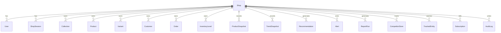

# ERD

```mermaid
erDiagram
  Shop ||--o{ User : has
  Shop ||--o{ ShopSession : has
  Shop ||--o{ Collection : owns
  Shop ||--o{ Product : owns
  Shop ||--o{ Variant : owns
  Shop ||--o{ Customer : owns
  Shop ||--o{ Order : owns
  Shop ||--o{ InventoryLevel : owns
  Shop ||--o{ ProductSnapshot : records
  Shop ||--o{ TrendSnapshot : records
  Shop ||--o{ Recommendation : generates
  Shop ||--o{ Alert : emits
  Shop ||--o{ ReportRun : generates
  Shop ||--o{ CompetitorStore : tracks
  Shop ||--o{ TrackedEntity : watches
  Shop ||--o{ Subscription : bills
  Shop ||--o{ AuditLog : writes
```
