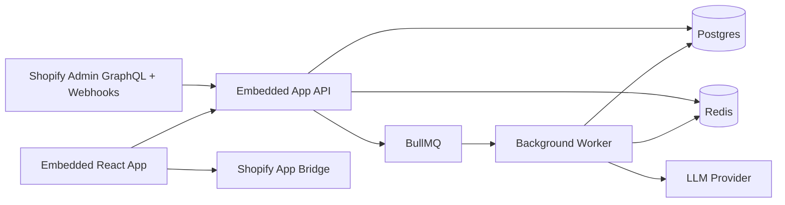

# System Architecture

## High-level architecture

## Services

- `apps/web`: embedded UI with Polaris, App Bridge, onboarding, dashboard, product intelligence, trackers, recommendations, reports, settings
- `apps/api`: OAuth, session handling, webhook ingestion, billing orchestration, internal API, tenant access control
- `apps/worker`: bulk imports, nightly syncs, KPI aggregation, scoring, trend detection, alert fanout, reports, AI summaries
- `packages/db`: Prisma schema and client
- `packages/shared`: shared job names, plans, API contracts, flags

## Multi-tenant model

- Every business record is keyed by `shopId`
- API resolves tenant from validated session and never trusts client-supplied shop identifiers
- Background jobs carry `shopId` and are idempotent by natural keys
- Support/admin tools require explicit role checks and audit logs

## Data ingestion strategy

- Initial sync uses Shopify bulk operations for products, variants, collections, orders, customers, and inventory
- Webhooks enqueue reconciliation jobs and return quickly
- Nightly sync backfills missed deltas and recomputes derived metrics

## Rate-limit-safe GraphQL pattern

- Shared GraphQL client with backoff and adaptive concurrency
- Bulk operations for large reads
- Narrow paginated queries for deltas and reconciliation
- Query shaping per page and plan tier
